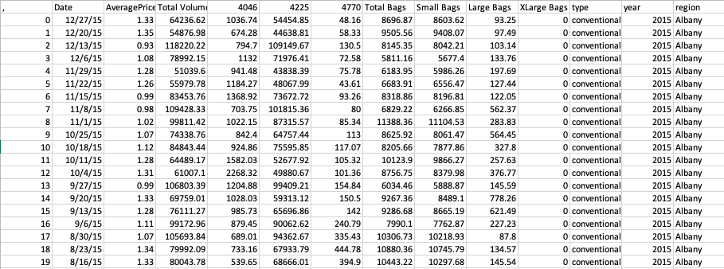
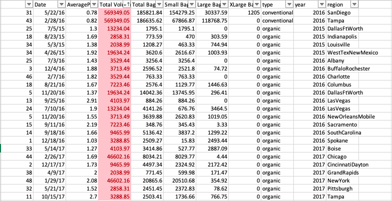

# Avocados Data Overview
The data backing this project and sequential blog post was provided by a gentleman named Justin Kiggins (here)[https://www.kaggle.com/datasets/neuromusic/avocado-prices] on Kaggle. For those who don't know, Kaggle is a website where people can post and retrieve public data sets. This particular data set stores avocado sales data from various areas across the United States from 2015-2018. More details regarding the data set can be found through the provided link although he was not as extensive in his explanation has he maybe should have been. I'll discuss this later.

### Sample

## Initial Thoughts/Tweaks
If you're wondering what the *4046*, *4225*, and *4770* columns represent, so did I. These numbers represent PLUs or Price Look-Up codes; these are essentially unique identifiers for different avocado types/brands. The only data these columns represent is quantity sold and since we already have a very nice total volume column, I found these three columns to be useless for my purposes and removed them.

Secondly, I noticed that just about every value that represents quantity is a decimal number. How exactly 0.89 of an avocado was sold is a huge question mark. The description provided by Kiggins indicates all of these values as quantities aside from the average price column. Therefore, I would suspect that Kiggins is either identifying his data incorrectly or made a great error in the vast majority of his entries. Either way, I do not want to round all of the values. This would taint the data greatly and force me to recalculate the total volume column with skewed data. I decided to keep that element of the data as is and to use rounding on the end results during analysis. This will yield more accurate calculations.

## Data Cleaning
My first calculations when cleaning a data set is to check for duplicates. There is no identifier column, which leaves the duplicate-finding process up to my creativity. I thought the column with the most unique values to likely be the total volume column, so that's the one I used. To my surprise, there were a handful of rows that had duplicate total volume values. These were a matter of coincidence, however, as no full rows were the same. Below are the duplicate values if you don't believe me.

The final odd detail that I cleaned up was some of the location values. These values included cities, states, regions, and the U.S. total. Regions (such as MidWest, South Central, West) pose a problem because although we may have a good idea of where these regions lie, it's never clearly defined. Due to Kiggins not specifying exact parameters, the data associated with these regions is unclear, possibly inaccurate, and shouldn't be taken seriously. 

That said, there were only one or two sets of entries with entire states. I decided to delete these entries as well. Finally, the deletion of hundreds of rows of data makes the U.S. total column inaccurate, forcing me to delete it as well. With those variables removed, we're left with a more consistent and reliable data set with data only from U.S. cities.

## Conclusion

The data set used in this project was definitely far from flawless. However, there is more than enough data for us to analyze and draw interesting conclusions from. Even after the aforementioned edits, we're left with 11 columns and 14,873 rows (14 and 18,250 originally) of usable data covering cities across the United States. One variable that must be kept in mind is the questionability of the volume counts. For the sake of accuracy I left the rounding to be done in analysis, so we need to remember to keep an eye on thoes values. All things considered, Kiggins provided a lot of well-organized data about avocados and now it's up to us to decide what that data is telling us.
